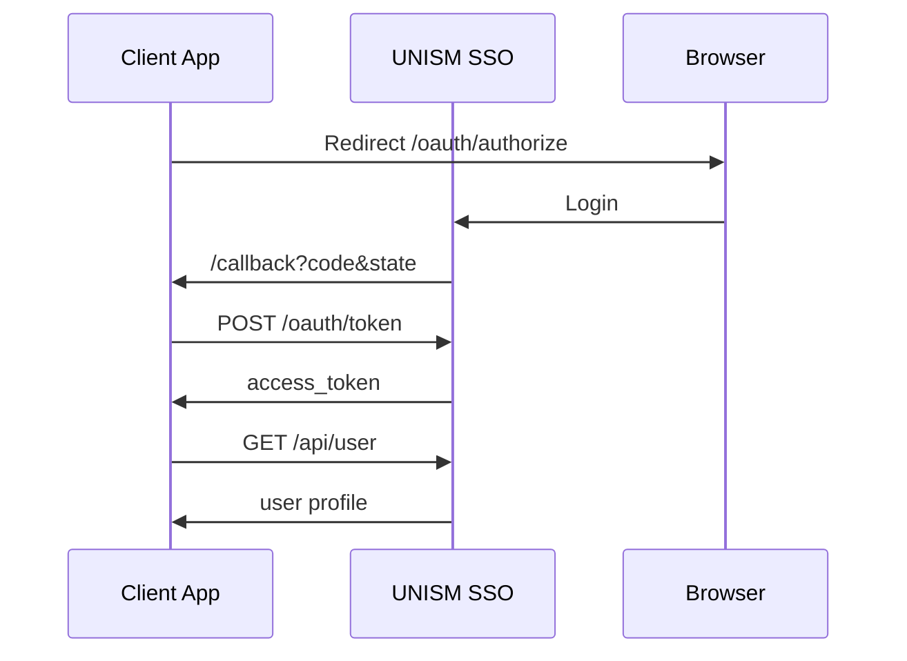

# UNISM SSO Integration Guide

Language-agnostic OAuth 2.0 reference for connecting any client to UNISM SSO.

Official SDKs: [README](../README.md)

## Prerequisites

1. SSO admin registers your app → **Client ID** (UUID) + **Client Secret**
2. **Redirect URI** must exactly match your callback URL
3. Production callbacks must use **HTTPS**

## Environment

```env
SSO_URL=https://sirisa.unism.ac.id
SSO_CLIENT_ID=<uuid>
SSO_CLIENT_SECRET=<secret>
SSO_CALLBACK_URL=https://your-app.example.com/callback
```

## OAuth 2.0 Authorization Code flow



### Step 1 — Authorize

```
GET {SSO_URL}/oauth/authorize
  ?client_id={CLIENT_ID}
  &redirect_uri={CALLBACK_URL}
  &response_type=code
  &scope=access-user
  &state={RANDOM_STATE}
```

Store `state` in session; validate on callback. Optional: `&role_id={id}` from SSO portal.

### Step 2 — Token exchange

```http
POST {SSO_URL}/oauth/token
Content-Type: application/x-www-form-urlencoded

grant_type=authorization_code&client_id=...&client_secret=...&redirect_uri=...&code=...
```

### Step 3 — User profile

```http
GET {SSO_URL}/api/user
Authorization: Bearer {access_token}
```

Filter `oauth_client_users[]` where `oauth_client_role.oauth_client.id === CLIENT_ID`.

## Token verification

```http
GET {SSO_URL}/api/verify-token              # minimal
GET {SSO_URL}/api/authorize/verify-token    # full (username + role)
Authorization: Bearer {token}
```

SDK usage: `verifyToken(token)` or `verifyToken(token, full: true)`.

## Browser redirects

| Action | Path |
|--------|------|
| Logout | `/sso/logout` |
| Portal | `/portal` |
| Profile | `/profile` |
| Password | `/edit-password` |

SDK usage: `ssoUrl('sso/logout')`, etc.

## API reference

Live OpenAPI spec: **`{SSO_URL}/developer/openapi.yaml`**

Swagger UI: **`{SSO_URL}/developer/api-docs`**

OAuth endpoints (`/oauth/*`) are not in the OpenAPI spec — implement Steps 1–2 above.

## Scopes

| Scope | Access |
|-------|--------|
| `access-user` | Full access (legacy default) |
| `read-user` | GET user endpoints |
| `write-user` | POST/PUT/DELETE user management |

## Multi-role users

1. Portal sends `role_id` at login → store in session
2. On sync, filter `oauth_client_users` by `clientId` + `role_id`
3. Fallback: first role matching `clientId`

## Generate clients for other languages

```bash
openapi-generator-cli generate \
  -i https://sirisa.unism.ac.id/developer/openapi.yaml \
  -g python -o clients/python
```

Implement OAuth Steps 1–2 manually.
