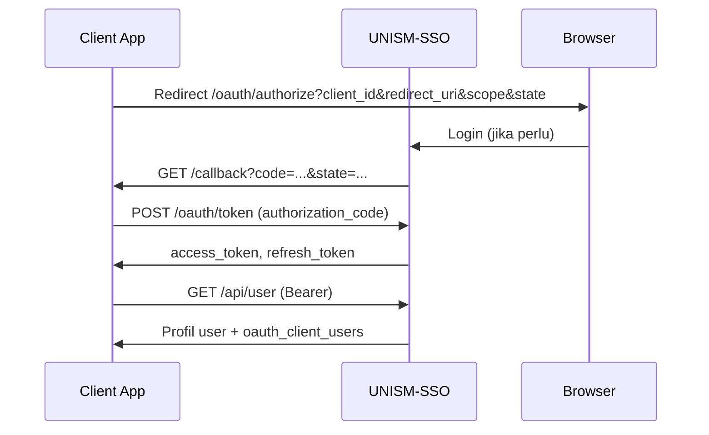

# Panduan Integrasi UNISM SSO (Semua Bahasa)

Dokumen ini menjelaskan protokol integrasi client ke **unism-sso** tanpa bergantung pada SDK tertentu.

## Prasyarat

1. Admin SSO mendaftarkan aplikasi Anda → dapat **Client ID** (UUID) + **Client Secret**
2. **Redirect URI** di SSO harus **exact match** dengan callback URL aplikasi
3. Production: callback wajib **HTTPS**

## Environment Variables

```env
SSO_URL=https://sirisa.unism.ac.id
SSO_CLIENT_ID=<uuid>
SSO_CLIENT_SECRET=<secret>
SSO_CALLBACK_URL=https://your-app.example.com/callback
```

## Alur OAuth2 Authorization Code



### Step 1 — Authorize (browser redirect)

```
GET {SSO_URL}/oauth/authorize
  ?client_id={CLIENT_ID}
  &redirect_uri={CALLBACK_URL}
  &response_type=code
  &scope=access-user
  &state={RANDOM_STATE}
```

Opsional: `&role_id={oauth_client_role_id}` jika user memilih role dari portal.

**Wajib:** simpan `state` di session, validasi di callback (CSRF protection).

### Step 2 — Token exchange

```http
POST {SSO_URL}/oauth/token
Content-Type: application/x-www-form-urlencoded

grant_type=authorization_code
&client_id={CLIENT_ID}
&client_secret={CLIENT_SECRET}
&redirect_uri={CALLBACK_URL}
&code={AUTHORIZATION_CODE}
```

Response:

```json
{
  "token_type": "Bearer",
  "expires_in": 3600,
  "access_token": "eyJ...",
  "refresh_token": "def..."
}
```

### Step 3 — Profil user

```http
GET {SSO_URL}/api/user
Authorization: Bearer {access_token}
Accept: application/json
```

Response berisi `oauth_client_users[]` — filter by `oauth_client.id === CLIENT_ID` untuk role aplikasi Anda.

## Verifikasi Token (API middleware)

**Minimal** (ringan):

```http
GET {SSO_URL}/api/verify-token
Authorization: Bearer {token}
```

**Lengkap** (username + role):

```http
GET {SSO_URL}/api/authorize/verify-token
Authorization: Bearer {token}
```

## Logout & Portal (browser redirect)

| Aksi | URL |
|------|-----|
| Logout global SSO | `{SSO_URL}/sso/logout` |
| Portal multi-app | `{SSO_URL}/portal` |
| Edit profil | `{SSO_URL}/profile` |
| Ganti password | `{SSO_URL}/edit-password` |

Logout di client app: hapus session lokal → redirect ke `/sso/logout`.

## OAuth Scopes

| Scope | Akses |
|-------|-------|
| `access-user` | Full access (default client lama) |
| `read-user` | GET user, username, roles |
| `write-user` | POST/PUT/DELETE user |

## API User Management

Kontrak lengkap: `spec/openapi.yaml` atau `{SSO_URL}/developer/openapi.yaml`

| Method | Endpoint | Fungsi |
|--------|----------|--------|
| GET | `/api/username?username=` | Cek user existing |
| POST | `/api/user` | Buat user baru |
| POST | `/api/oauthClientUsers` | Assign role ke client |
| PUT | `/api/user/{old}/{new}` | Update user |
| POST | `/api/user/actived/{username}` | Aktif/nonaktif |
| DELETE | `/api/user/{username}` | Hapus dari client (body: `oauth_client_role_id`) |

Semua endpoint di atas membutuhkan `Authorization: Bearer {access_token}`.

## Multi-role per client

Jika user punya banyak role di satu client:

1. Portal kirim `role_id` saat login
2. Simpan di session
3. Saat sync user, filter `oauth_client_users` by `clientId` + `role_id`
4. Fallback: ambil role pertama yang match `clientId`

## Generate client untuk bahasa lain

```bash
# Install: https://openapi-generator.tech
openapi-generator-cli generate -i spec/openapi.yaml -g <generator> -o clients/<lang>
```

Generator populer: `python`, `go`, `java`, `csharp`, `php`, `ruby`, `kotlin`.

> OAuth endpoints (`/oauth/*`) tidak ada di OpenAPI spec — implementasi manual mengikuti Step 1–2 di atas.

## SDK resmi

| Bahasa | Package |
|--------|---------|
| JavaScript/TypeScript | `@rizalrepo/sso-client` |
| PHP native | `rizalrepo/sso-client-core` |
| PHP/Laravel | `rizalrepo/sso-client` |

## Referensi implementasi

- `packages/javascript/src/client.ts` — core HTTP client
- `packages/php-laravel/src/SSOController.php` — Laravel controller
- `unism-presensi/src/services/ssoService.ts` — contoh Express backend
