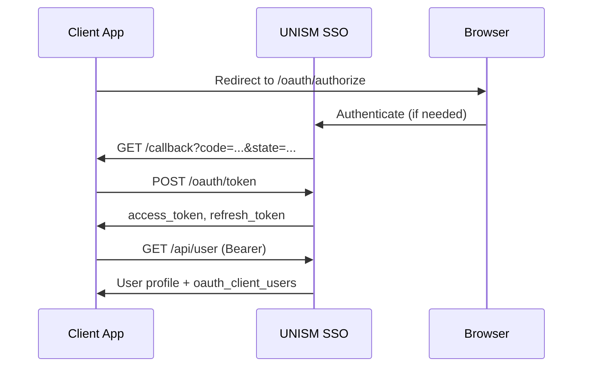

# UNISM SSO Integration Guide

Language-agnostic reference for connecting any client application to **UNISM SSO** (`unism-sso`).

This document describes the HTTP protocol. Official SDKs are optional — see [Official SDKs](#official-sdks).

---

## Prerequisites

1. **Client registration** — An SSO administrator registers your application and provides a **Client ID** (UUID) and **Client Secret**.
2. **Redirect URI** — The callback URL in your app must **exactly match** the redirect URI registered in SSO.
3. **HTTPS** — Production callback URLs must use HTTPS. `localhost` is rejected in production.

---

## Environment variables

```env
SSO_URL=https://sirisa.unism.ac.id
SSO_CLIENT_ID=<uuid>
SSO_CLIENT_SECRET=<secret>
SSO_CALLBACK_URL=https://your-app.example.com/callback
```

---

## OAuth 2.0 Authorization Code flow

UNISM SSO uses the standard **Authorization Code** grant with a confidential client (client secret required). PKCE is not required for existing clients.



### Step 1 — Authorize (browser redirect)

Redirect the user's browser to:

```
GET {SSO_URL}/oauth/authorize
  ?client_id={CLIENT_ID}
  &redirect_uri={CALLBACK_URL}
  &response_type=code
  &scope=access-user
  &state={RANDOM_STATE}
```

**Optional:** append `&role_id={oauth_client_role_id}` when the user selects a role from the SSO portal.

**Required:** generate a random `state`, store it in the user session, and validate it on callback (CSRF protection).

### Step 2 — Exchange authorization code for tokens

```http
POST {SSO_URL}/oauth/token
Content-Type: application/x-www-form-urlencoded

grant_type=authorization_code
&client_id={CLIENT_ID}
&client_secret={CLIENT_SECRET}
&redirect_uri={CALLBACK_URL}
&code={AUTHORIZATION_CODE}
```

**Success response:**

```json
{
  "token_type": "Bearer",
  "expires_in": 3600,
  "access_token": "eyJ...",
  "refresh_token": "def..."
}
```

| Token | Lifetime |
|-------|----------|
| Access token | 1 hour |
| Refresh token | 7 days |

### Step 3 — Fetch user profile

```http
GET {SSO_URL}/api/user
Authorization: Bearer {access_token}
Accept: application/json
```

The response includes `oauth_client_users[]`. Filter entries where `oauth_client_role.oauth_client.id === CLIENT_ID` to resolve the user's role for your application.

---

## Token verification (API middleware)

Use these endpoints to validate Bearer tokens on protected API routes.

### Minimal response (recommended for lightweight checks)

```http
GET {SSO_URL}/api/verify-token
Authorization: Bearer {token}
```

**200 OK:**

```json
{ "valid": true, "token_id": 123, "user_id": 45, "scopes": ["access-user"] }
```

### Full response (includes username and role)

```http
GET {SSO_URL}/api/authorize/verify-token
Authorization: Bearer {token}
```

**200 OK:**

```json
{
  "status": true,
  "message": "Token is valid",
  "data": {
    "token_id": 123,
    "username": "1234567890",
    "role": 63,
    "client_id": "uuid-client-id"
  }
}
```

---

## Browser redirects (logout & portal)

| Action | URL |
|--------|-----|
| Global SSO logout | `{SSO_URL}/sso/logout` |
| Multi-app portal | `{SSO_URL}/portal` |
| Edit profile | `{SSO_URL}/profile` |
| Change password | `{SSO_URL}/edit-password` |

**Logout pattern:** clear the local session in your app, then redirect the browser to `{SSO_URL}/sso/logout`.

---

## OAuth scopes

| Scope | Access |
|-------|--------|
| `access-user` | Full access (default for legacy clients) |
| `read-user` | `GET` user, username, roles |
| `write-user` | `POST` / `PUT` / `DELETE` user management |

New clients may request `read-user write-user` for least-privilege access. Legacy clients use `access-user`.

---

## User management API

Full request/response schemas: `spec/openapi.yaml` or `{SSO_URL}/developer/openapi.yaml`

All endpoints require `Authorization: Bearer {access_token}` and scope `write-user` or `access-user`.

| Method | Endpoint | Description |
|--------|----------|-------------|
| `GET` | `/api/username?username=` | Check if a user exists |
| `POST` | `/api/user` | Create a new user |
| `POST` | `/api/oauthClientUsers` | Assign a role to a client |
| `PUT` | `/api/user/{old}/{new}` | Update a user |
| `POST` | `/api/user/actived/{username}` | Activate or deactivate a user |
| `DELETE` | `/api/user/{username}` | Remove user from client (body: `oauth_client_role_id`) |

---

## Multi-role per client

When a user has multiple roles on the same OAuth client:

1. The SSO portal sends `role_id` during login.
2. Store `role_id` in the session.
3. When syncing the user, filter `oauth_client_users` by `clientId` and `role_id`.
4. **Fallback:** use the first entry matching `clientId`.

---

## Generating clients for other languages

```bash
# Install: https://openapi-generator.tech
openapi-generator-cli generate -i spec/openapi.yaml -g <generator> -o clients/<lang>
```

Popular generators: `python`, `go`, `java`, `csharp`, `php`, `ruby`, `kotlin`.

> **Note:** OAuth endpoints (`/oauth/*`) are **not** included in the OpenAPI spec. Implement Steps 1–2 manually.

---

## Official SDKs

| Language | Package |
|----------|---------|
| JavaScript / TypeScript | `@rizalrepo/sso-client` |
| PHP (native) | `rizalrepo/sso-client-core` |
| PHP / Laravel | `rizalrepo/sso-client` |

### Reference implementations

| File | Description |
|------|-------------|
| `packages/javascript/src/client.ts` | Core HTTP client (TypeScript) |
| `packages/php-native/src/SSOClient.php` | Core HTTP client (PHP) |
| `packages/php-laravel/src/SSOController.php` | Laravel controller with session sync |

---

## Rate limits

| Endpoint group | Limit |
|----------------|-------|
| Token verification | 30 requests / minute / IP |
| Protected API | 60 requests / minute / user or IP |

---

## Live API documentation

| URL | Description |
|-----|-------------|
| `{SSO_URL}/developer/api-docs` | Swagger UI |
| `{SSO_URL}/developer/openapi.yaml` | OpenAPI YAML spec |
